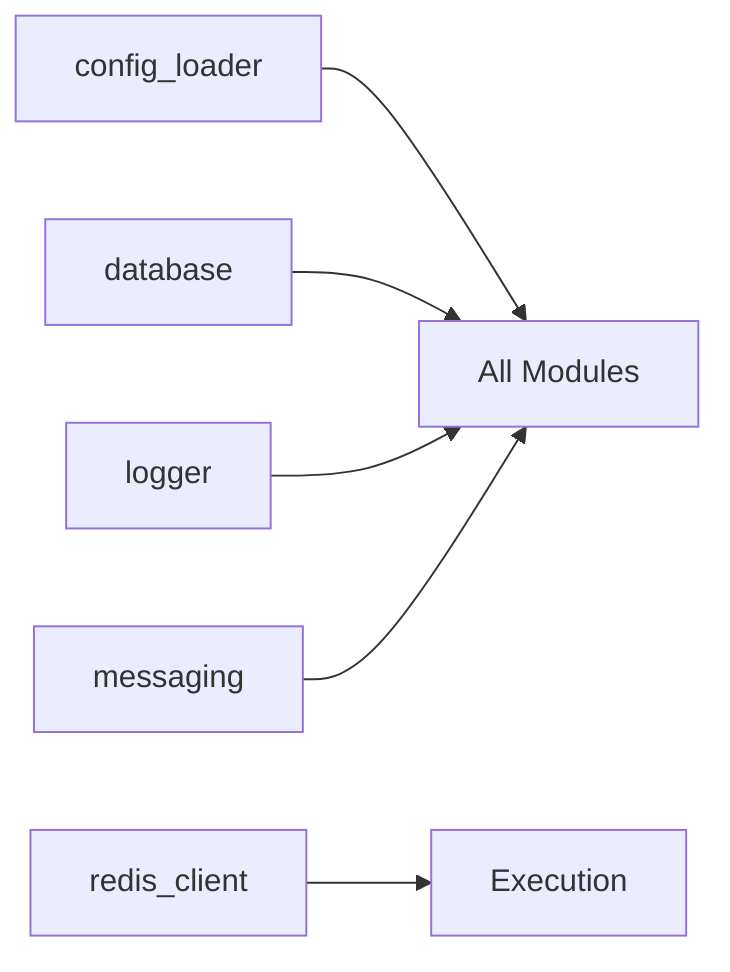

# Common 모듈 리팩토링 계획 v1

**최종 업데이트**: 2025-11-05 20:58 UTC+09:00  
**PR8-Phase2**: Calculation 모듈 종합 개선)

**상태 업데이트(2025-11-02)**: PR 1~5 범위와 정합성 확인 완료(모드/환경/DB/메시징 정책 문서 최신). 아래 To‑Do 항목은 Phase 6 이후 계속 유지.

## 목적
- 공통 유틸을 표준화하여 모든 모듈에서 일관된 방식으로 사용
- 설정/로그/DB/메시징/Redis/유틸 집합을 명확한 책임으로 분리
- 모드/환경 변수 정책을 문서로 고정해 재현성 확보

## 구성 요소 (현행)
- `config_loader.py`
  - `.env` 로드 + 환경변수 치환(`${VAR}`) + YAML 병합
  - 최상위 `mode` 지원 (없으면 ENV `TRADING_MODE`, 기본값 `paper`)
- `database.py`
  - PostgreSQL 단일 DB 정책. `get_db_connection()`, `test_db_connection()`
  - SQLite 관련 함수 제거 완료
- `logger.py`
  - 애플리케이션/모듈별 로거 생성, 중복 제거
- `messaging.py`
  - 텔레그램/로그 메시지 래퍼, 알림 19종(시스템/리스크/연결 등)
- `metrics_parser.py`
  - TUNING_VIBLE 파서, `objective_score`, `constraints_ok`
- `redis_client.py`
  - Redis 연결/기본 연산 래퍼 (옵션 기능)
- `symbol_manager.py`
  - 심볼 로드/관리(수동/자동 모드)
- `tuning_cli.py`
  - 튜닝 보조 CLI 유틸
- `tuning_core.py`, `tuning_scheduler.py`
  - 위치는 common이지만, 문서상 "튜닝 서브시스템"으로 분리 (별도 문서: REFACTORING_tuning_v1.md)

## 정책 고정 (Mode/Config)
- 모드 우선순위: `config.yml.mode` > `ENV TRADING_MODE` > `paper`
- 모든 서비스는 `config_loader`로 단일 진입
- 민감 설정: .env에 보관, config.yml에서 `${VAR}` 치환

## DB/로그/메시징 표준
- DB: PostgreSQL 단일(트랜잭션/에러 핸들링 공통화)
- 로그: 공통 포맷, 중복 로깅 방지
- 메시징: `tg()` 통일, 장애 시 베스트에포트

## 상호작용


## 리팩토링 과제 (To‑Do)
1) DB 함수 시그니처 표준화 문서화 및 샘플 적용
2) `config_loader` 유닛 테스트(ENV override/기본값 케이스)
3) 메시징 모듈: 중복 전송 가드/우선순위 큐 가이드 보강
4) Redis 클라이언트 타임아웃/재시도 정책 명세
5) 민감정보 로깅 필터 정책 문서화

## 테스트
- config: ENV/기본값/치환 단위 테스트
- DB: 연결/예외/재시도 모의 테스트
- messaging: 오프라인/속도 제한 시나리오

---

## ✅ PR8-Phase2: Calculation 모듈 종합 개선 (2025-11-05)

### 배경
- **Phase1**: leverage_suggestion() 다차원 개선 완료 (6가지 요소)
- **Phase2**: 나머지 함수들도 동일한 수준으로 개선 필요

### 개선 항목

#### 1. 하드코딩 제거 ✅
- `messaging.py`: max_positions=5 하드코딩 → config 읽기
- `calculations.py`: tick_size 하드코딩 → API 동적 조회 (예정)
- `calculations.py`: funding_rate 고정 → API 실시간 조회 (예정)

#### 2. position_size_advanced() (예정)
**현재**: 단순 리스크 기반
```python
qty = (equity * risk_frac) / (entry - sl)
```

**개선**: 다차원 고려
- 변동성 (ATR)
- 전략 성과 (Sharpe, Winrate)
- 신뢰도
- Drawdown 페널티
- 레짐

#### 3. price_levels_advanced() (예정)
**현재**: 고정 ATR × 배수
```python
sl = entry - atr * 1.5
tp = entry + rr * (entry - sl)
```

**개선**: 동적 조정
- 지지/저항선 고려
- 변동성 상태 반영
- 최근 고저가 검증

#### 4. Trailing Stop (예정)
- Breakeven 이동
- 동적 SL 상승
- 수익 보호

### 문서
- `PR8_PHASE2_CALCULATION_ENHANCEMENT.md`: 상세 설계
- `REFACTORING_common_v1.md`: 본 문서 (업데이트)

---

## 참고
- 아키텍처: `REFACTORING_문서아키텍처.md`
- Execution 연동: `REFACTORING_execution_v1.md`
- 튜닝 연동: `REFACTORING_tuning_v1.md`
- PR8-Phase2: `PR8_PHASE2_CALCULATION_ENHANCEMENT.md`
