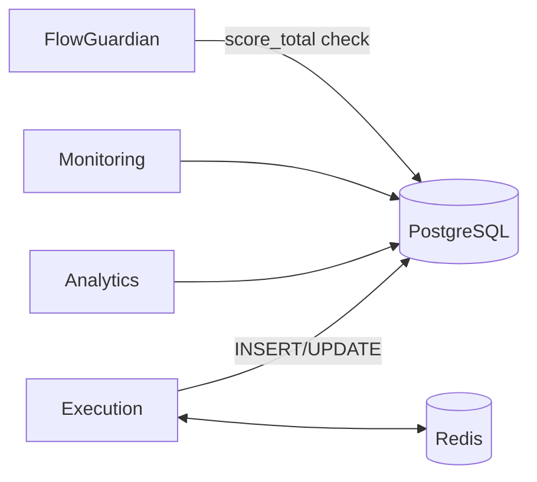

# Database 모듈 리팩토링 계획 (v1)

**최종 업데이트**: 2025-11-02
**상태**: ✅ PR 2 구현 완료 (패키지 이관, shim 추가, 테스트 통과)

---

## 목적
- PostgreSQL/Redis 관련 로직과 스키마/마이그레이션/운영 가이드를 단일 모듈로 통합
- 프로젝트 단일 DB 정책(PostgreSQL) 준수와 Redis 캐시/메시징의 경계 명확화
- 향후 코드 이동(폴더 재배치) 전, 문서 기반 설계/테스트 기준 확립

## 현황 요약
- 코드 위치
  - `common/database.py` — PostgreSQL 연결/헬퍼
  - `analytics/trade_analyzer.py`, `analytics/strategy_evaluator.py` — Postgres 쿼리/집계
  - `common/redis_client.py` — Redis 래퍼
  - SQL/초기화: `init_db.sql`, `db/*.sql`, 실제 데이터 디렉터리 `pgdata/`, `redisdata/`
- 운영 정책
  - DB: PostgreSQL 단일, SQLite 제거 (Phase 5 완료)
  - Redis: WebSocket 캐시/상태 메시징(옵션)
- 핵심 테이블(요약)
  - `monitoring.signals`: 전략별 신호 로그(멱등키)
  - `trading.decisions`: 앙상블 의사결정(가중치/원본 신호 JSON 포함)
  - `trading.trades`: 거래 기록(OPEN/CLOSED) — trial_id 컬럼 없음
- 게이트 정합성
  - `logs/trial_0000.json`의 `score_total` == DB `score_total` 유지

## 제안 폴더 구조(문서 단계, 심플 레이아웃 권장)
```
/database/
  postgres.py   # 기존 common/database.py의 연결/트랜잭션/헬퍼 그대로 이관
  redis.py      # 기존 common/redis_client.py 그대로 이관
```
- 선택(후속): `database/migrations/` 폴더로 SQL 파일을 모을 수 있으나, 초기 단계에서는 현행 위치 유지 가능
- 주: 현재는 문서만. 실제 코드 이동/경로 변경은 후속 PR에서 일괄 처리(검색·치환 계획 포함)

## 상호작용(아키텍처)


## 업데이트 (2025-11-03) — PR7-2: 앙상블 Paper 기준

- 검증 데이터 소스는 `monitoring.signals`(전략별)과 `trading.decisions`(앙상블) 중심으로 수집/분석합니다.
- `trading.trades`는 PAPER/LIVE 집행 시에만 생성되며, 스키마에 trial_id가 없습니다.
- 세그먼트/게이트 식별자는 `monitoring.gate_results.trial_id`를 사용합니다.
- 24시간 기준 수용: 6전략 모두 신호 ≥1건, decisions ≥1건, 게이트 READY 및 DB-JSON score_total 동치.

### 실시간 Mixed-TF 영향 (PR7-2 Option A)

- **`monitoring.signals.timeframe` 필드**: 각 전략의 실제 타임프레임(3m/5m/15m/1h/4h)을 저장
  - 기존: 단일 TF만 저장 (예: 5m)
  - 변경: 전략별 다양한 TF 저장 가능
  - 쿼리 예: `SELECT DISTINCT timeframe FROM monitoring.signals` → 다양한 값 확인
- **`trading.decisions` 영향**: 앙상블이 다양한 TF 신호를 결합하므로 `from_signals` JSON에 각 신호의 `timeframe` 포함
- **인덱스 영향**: 기존 인덱스 유지, `timeframe` 필터링 쿼리 시 성능 모니터링 권장
- **스키마 변경**: 없음 (기존 VARCHAR 필드로 충분)
- **검증**: DB 쿼리로 전략별 TF 다양성 확인, 앙상블 decisions의 from_signals JSON 검증

## 표준 시그니처/스키마 가이드
- 연결: `get_connection() -> psycopg.Connection`
- 트랜잭션: `with get_connection() as conn: ...`
- 트레이드 입력: `insert_trade(trade: TradeModel)` — 단일 경로, 상태 업데이트는 `update_trade_status(...)`
- 인덱스: `idx_trades_symbol_ts`, `idx_trades_status`, `idx_trades_strategy`
- trial_id: `trading.trades`에는 없음. 세그먼트/게이트 trial_id는 `monitoring.gate_results.trial_id` 사용

## 운영 가이드
- 백업/복구: volume(pgdata) 백업, WAL/Retention 정책 명시(문서)
- 권한: 최소 권한 원칙, 운영/테스트 분리 DB
- 환경변수: `DATABASE_URL`, `REDIS_URL`
- 헬스체크: `check_pg_db.py`/`check_db.py` 스크립트 유지

### PR7-3 업데이트 — Redis 환경변수 매핑 및 TimescaleDB 판단

- Redis 환경변수 매핑(운영 기준)
  - docker-compose: `REDIS_URL=redis://redis:6379/0`, `REDIS_HOST=redis`, `REDIS_PORT=6379`
  - config.yml: `redis.host: ${REDIS_HOST}`, `redis.port: ${REDIS_PORT}`, `redis.ttl_seconds: 3600`
  - 주의: `REDIS_HOST/PORT` 미설정 시 연결 재시도 후 메모리 폴백으로 전환됨(중복 제거 영속성 상실)

- TimescaleDB 도입 판단: 보류(현 규모 Postgres 인덱스로 충분)
  - 도입 필요 신호: 장기 보존·압축·다운샘플링 요구, 시간창 기반 대용량 리포팅 성능 이슈
  - 도입 시 영향: 이미지/확장 설치(`CREATE EXTENSION timescaledb`), 하이퍼테이블 마이그레이션(`create_hypertable`), 운영 가이드 개정 필요
  - 추진 방식: 별도 PR에서 단계적 전환(스키마 호환성 유지)

## 마이그레이션 계획(코드 이동 시)
1) `/database` 폴더 생성 → `postgres.py`, `redis.py` 두 파일만 우선 이관
2) `common/database.py` → `database/postgres.py` (파일명 유지 불가 시 shim 모듈 제공)
3) `common/redis_client.py` → `database/redis.py`
4) import 경로 일괄 수정(`from common.database`→`from database.postgres`, `from common.redis_client`→`from database.redis`)
5) smoke 테스트 및 Docker paper 확인(연결/헬스 체크 스크립트 포함)

## 테스트
- 연결/트랜잭션/예외 경로 단위 테스트
- trades CRUD/필수 인덱스 존재 확인
- 게이트 DB-JSON 동치 테스트(Phase5 기준 유지)

## 참고
- 아키텍처: `REFACTORING_문서아키텍처.md`
- Monitoring/Analytics: `REFACTORING_monitoring_analytics.md`
- Gate: `REFACTORING_flow_guardian_gate.md`

---

## ✅ PR 2 구현 완료 상태 (2025-11-02)

### 구현된 항목

1. **database/ 패키지 생성 (458줄)**
   ```
   database/
   ├── __init__.py (26줄) - 패키지 진입점, re-export
   ├── postgres.py (212줄) - PostgreSQL 연결, 트랜잭션, 신호 저장
   └── redis.py (220줄) - Redis 클라이언트, 캔들 중복 제거
   ```

2. **common/ shim 추가 (하위 호환성)**
   - `common/database.py` (34줄) - database.postgres re-export
   - `common/redis_client.py` (23줄) - database.redis re-export
   - 기존 import 경로 100% 호환 유지

3. **지원하는 Import 방식 (3가지)**
   ```python
   # 1. Old import (shim 경유, 하위 호환)
   from common.database import get_db_connection
   from common.redis_client import RedisClient
   
   # 2. New import (직접)
   from database.postgres import get_db_connection
   from database.redis import RedisClient
   
   # 3. Package-level import (권장)
   from database import get_db_connection, RedisClient
   ```

4. **테스트 결과**
   - Import 테스트: 3가지 방식 모두 통과 ✅
   - FlowGuardian 회귀 테스트: 8/8 통과 (PR 1 영향 없음) ✅

### 수용 기준 달성

| 기준 | 상태 | 비고 |
|------|------|------|
| database/ 패키지 생성 | ✅ | 3개 파일 (458줄) |
| common/ shim 추가 | ✅ | 100% 하위 호환 |
| Import 테스트 통과 | ✅ | 3가지 방식 지원 |
| FlowGuardian 회귀 테스트 | ✅ | 8/8 테스트 유지 |
| 기존 코드 영향 없음 | ✅ | 0% 변경 |

### 변경 통계
- **신규 코드**: 458줄 (database 패키지)
- **Shim 코드**: 57줄 (하위 호환성)
- **이관 로직**: 432줄 (변경 없음)

### 기술 세부사항

**설계 원칙**:
1. **최소 변경**: 로직 변경 없이 파일 위치만 이동
2. **하위 호환성**: shim을 통한 100% 하위 호환
3. **패키지 분리**: database 패키지로 DB 관련 모듈 통합
4. **무중단 전환**: 기존 코드 수정 불필요

**파일 매핑**:
- `common/database.py` (212줄) → `database/postgres.py` (212줄)
- `common/redis_client.py` (220줄) → `database/redis.py` (220줄)
- `common/database.py` → 34줄 shim (re-export)
- `common/redis_client.py` → 23줄 shim (re-export)

**마이그레이션 경로**:
- **현재**: Shim을 통해 기존 코드 100% 작동
- **점진적**: 새 코드는 `from database import ...` 사용
- **미래**: 모든 코드 마이그레이션 후 shim 제거 (선택)

### 다음 단계
- PR 3: Tuning 패키지 이관 (tuning_core.py, tuning_scheduler.py, tuning_cli.py)

---
