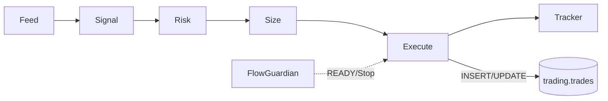

# Execution 모듈 리팩토링 계획 (v1)

## 목적
- 단일 실행 파이프라인 정리: Feed → Signal → Risk/Size → Order/Close → DB 기록
- PAPER/LIVE/Backtest 모드 간 로직 공유 극대화, 모드별 어댑터만 교체
- Gate(FlowGuardian) 연동: READY 없으면 PAPER/LIVE 진입 금지

## 현행 구조 요약
- 엔트리포인트: `main.py` → `execution.engine.run()`
- 어댑터: `execution/adapters.py` → `feed, broker, clock` (mode별 구현)
- 서브모듈
  - `risk_manager.py` (일일손실, 연속손실, 익스포저 등)
  - `position_sizer.py` (수량/레버리지/버퍼)
  - `portfolio_manager.py` (포지션 제한/분산)
  - `tp_manager.py` (TP/SL/트레일링)
  - `position_tracker.py` (상태/체결 추적)
- 데이터 소스
  - `execution/data_sources/backtest.py`, `execution/data_sources/live.py`
- DB 기록: PostgreSQL `trading.trades` 

## 데이터 흐름

### DB/Redis 연동(운영)
- Collector(WebSocket): Redis dedup 키 `candle:seen:{symbol}:{tf}:{closed_at}` 저장 후 엔진 큐로 전달
- Engine:
  - `save_signal_to_db()` → `monitoring.signals` (옵션)
  - `save_trade_to_db()` → `trading.trades` INSERT(OPEN)
  - `close_trade_in_db()` → `trading.trades` UPDATE(CLOSED, pnl, ts_close)
- Analytics/Tuning: `trading.trades` 조회로 KPI/랭킹/롤링 메트릭 집계

## 업데이트 (2025-11-03) — PR7-2: 앙상블 Paper 반영

- 운영 테스트는 기본적으로 “앙상블 Paper” 경로를 사용합니다.
- 신호 저장은 `monitoring.signals`, 앙상블 의사결정 저장은 `trading.decisions`(있을 경우) 기준으로 분석합니다.
- 거래 기록 `trading.trades`에는 trial_id 컬럼이 없습니다. 세그먼트/게이트 식별은 `monitoring.gate_results.trial_id`를 사용합니다.
- Docker 운용: 기본 1컨테이너(앙상블 Paper), 필요 시 프로파일로 전략별 격리 디버깅(`--profile paper-<strategy>`)

## 모드 동작 원칙
- 공통 로직은 `engine.py`에서 통일, 차이는 어댑터에서만 발생
- 모드 결정: `CFG.mode` > `ENV TRADING_MODE` > `paper` (이미 main.py 반영)
- Backtest는 Gate/검증/실험용. 운영 튜닝은 PAPER/LIVE DB 기반

## DB 정책
- PostgreSQL 단일화, SQLite 제거
- 인덱스: `idx_trades_symbol_ts`, `idx_trades_status`, `idx_trades_strategy`
- trial_id: 사용하지 않음(스키마 미보유). 세그먼트/게이트는 `monitoring.gate_results.trial_id` 활용

## 모니터링/알림 연동
- 모니터링: 성능, 지연, 큐/재시도 지표 → `monitoring/*`
- 알림: `common/messaging.tg()`로 상태/리스크/오류 전달

## 리팩토링 과제 (To‑Do)
1) ✅ **큐/백프레셔/재시도 지표 표준화 → 모니터링 노출 (PR5 완료)**
   - collectors/websocket_collector.py: queue.health 이벤트 발행 (10초 주기)
   - 메트릭: size, maxsize, usage_pct, drops, retries
   - config.yml: monitoring.websocket.queue 설정 추가
   - 임계치 경고: 80% 이상 사용률
2) 예외·재시도 정책 문서화 및 유닛 테스트 추가
3) DB I/O 경로 단일 함수화 (insert/update/close 공통 시그니처)
4) ✅ Gate READY 검사 훅을 엔진 시작 시 강제 (PR1 완료)
5) position_tracker와 broker 체결 이벤트 동기화 검증 로깅 추가
6) config 파라미터 맵 명세서 추가 (risk/size/portfolio/tp)

## 테스트
- 단위: risk/size/portfolio/tp 각각 경계값 케이스
- 통합: 3모드 공통 경로에서 동일 시나리오 재현(Feed/Order/Close)
- 회귀: trial_id 있는/없는 트레이드 저장·조회

## PR7 검증 완료 (2025-11-03)

### E2E 흐름 검증
- ✅ Collector → Indicators → Signals → Strategies → Ensemble → Risk → Execution → DB 전체 흐름 확인
- ✅ `save_trade_to_db()`: trading.trades INSERT(OPEN) 정상
- ✅ `close_trade_in_db()`: trading.trades UPDATE(CLOSED) 정상
- ✅ Redis dedup: `candle:seen:{symbol}:{tf}:{closed_at}` 키 생성 확인

### 실제 동작 검증
- **Paper 모드 24시간 실행**: scalping 전략 (2025-11-03 00:25~)
- **목표**: trading.trades 레코드 최소 1건 이상 발생
- **상태**: 진행 중 (내일 오전 확인)

## 실시간 Mixed-TF 설계 반영 (PR7-2 Option A)

### 배경
- 앙상블 모드에서 전략별 타임프레임(3m/5m/15m/1h/4h)이 혼재
- WebSocket 스트림 수를 최소화하고 엔진에서 리샘플링으로 일관성 확보

### 구현
- **Feed**: `feed.base_timeframe=1m` 단일 구독 (config.yml)
- **Adapters**: `execution/adapters/__init__.py`에서 WebSocketCollector 생성/프리로드 시 base TF 사용
- **Engine**: `execution/engine.py`
  - 심볼별 베이스 DF(1m)를 전략별 실제 TF로 pandas resample
  - 리샘플 조건: 요청 TF가 베이스 TF의 배수일 때만 수행 (안전가드)
  - `strategy.signal_logic(df_tf, cfg)` 호출 시 리샘플된 DF 전달
  - `signal.ts`는 전략 TF의 닫힘 시각으로 설정
  - DB 저장 시 `monitoring.signals.timeframe`을 각 전략의 실제 TF로 기록

### 영향
- Collector 로직(중복 제거·백필·큐 헬스)은 변경 없음
- 전략별 신호 생성 타이밍이 각 TF 닫힘 시각에 맞춰 발생
- DB/로그에서 전략별 실제 TF 확인 가능

### 검증
- 시작 로그/텔레그램: "base=1m, anchor=5m" 표시
- DB 쿼리: `SELECT DISTINCT timeframe FROM monitoring.signals` → 3m/5m/15m/1h/4h 등 다양한 값 확인
- 성능: 리샘플 계산 부담 모니터링 (필요 시 프로파일링)

## 문서/운영 가이드 반영 사항
- `REFACTORING_문서아키텍처.md` 다이어그램 참조 링크
- `REFACTORING_개선계획.md`의 Execution 리팩토링 항목과 동기화
- **PR7_COMPLETE.md**: E2E 테스트 결과 문서화
- **REFACTORING_collector_v1.md**: 구독 정책 업데이트 완료
