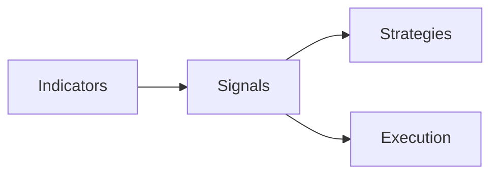

# Signals 모듈 리팩토링 계획 (v1)

**상태 업데이트(2025-11-02)**: PR 4 정합성 확인 완료(Indicators 인터페이스/Contract 테스트 준수). 성능/출력 스키마 표준화 과제는 PR6 이후 지속.
**최종 업데이트**: 2025-11-02 20:00
**상태**: ✅ PR 4 연계 완료 (Indicators 인터페이스 표준화)

---

## 목적
- 전략 독립의 신호 생성 레이어를 표준화하여 성능/가독성/테스트 용이성 확보
- Indicators와 Strategies 사이의 경계를 명확히 하고, 최소 공통 시그니처를 적용

## 현행
- 위치: `signals/signal_generator.py`, `signals/signal_storage.py`
- 역할: 인디케이터 기반 신호 계산, 임계값/필터, 신호 보관(옵션)
- 입력: Indicators 확장 컬럼이 추가된 DataFrame + config

## 인터페이스 규약(제안)
- 함수형 API(권장):
  - `generate_signals(df: pd.DataFrame, config: dict) -> Dict[str, Any]`
  - 불변 입력, 명시적 출력(신호/근거/품질 메타)
- 최소 요구:
  - `min_bars_for_signal` 만족 시에만 신호 생성
  - `quality_flags` 포함(데이터 결손/이상치 여부)
- 저장(옵션):
  - `signal_storage.py`에 표준 모델/CRUD, trial_id/strategy_id tagging

## 데이터 흐름

## 리팩토링 과제(To‑Do)
1) 시그널 출력 스키마 표준화: { action, confidence, reason, features }
2) `min_bars_for_signal`와 NaN 처리 정책 문서화 및 테스트 추가
3) Signals ↔ Strategies 계약 명세화(필드/단위/스케일)
4) 고빈도 호출 캐시/샘플링 최적화(선택)

## 테스트
- 저/고 거래량, 결손, 급등락 환경에서의 신호 품질 테스트
- 시그널-전략 합성 테스트(엔진 통합 경로 사전 검증)

## 참고
- Indicators: `REFACTORING_indicators_v1.md`
- Strategies/Ensemble: `REFACTORING_strategies_v1.md`
- 아키텍처: `REFACTORING_문서아키텍처.md`
