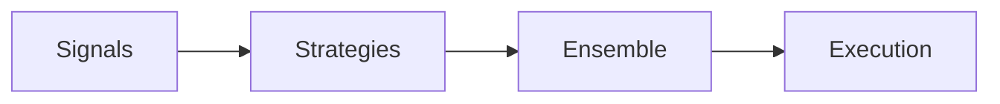

# Strategies/Ensemble 리팩토링 계획 (v1)

**상태 업데이트(2025-11-02)**: PR 4 인터페이스·계약 정합성 확인 완료(Strategies 입력/출력 스키마 표준과 연결 경로 검증). 앙상블 정책·표준화 과제는 Phase 6 이후 지속.

**Critical 버그 수정(2025-11-02)**: 6개 전략 모두에서 Timestamp → int 변환 버그 발견 및 수정. 실제 Paper 모드 동작 불가 상태였음.

**리팩토링 필요성 재확인**: E2E 테스트 부족, 앙상블 전략 개념 명확화 필요, 실제 흐름 검증 미비

## 목적
- 개별 전략과 앙상블 흐름을 표준화하여 교체/조합의 유연성과 테스트 용이성 확보
- Signals와 Execution 사이의 계약을 명확히 하고 공통 파라미터 스키마를 정리

## 현행
- 위치: `strategies/*.py` (scalping, daytrade, swing, trend, reversion, breakout), `strategies/ensemble.py`
- 로딩: `strategies/__init__.py::load_strategies(config)`
- 조합: `ensemble.combine_signals()` 기반 다중 전략 결합

## 인터페이스 규약(제안)
- 전략 함수 시그니처: `signal_logic(df: DataFrame, config: dict) -> Dict[str, Any]`
- 공통 출력 필드: { action, confidence, reason, features }
- 파라미터 스키마: 각 전략 하위 `config.strategies.<name>`에 정의, 공통 키는 상위에서 상속

## 데이터 흐름


## 앙상블 정책(요약)
- 투표/가중/위험평형 3가지 모드 문서화
- 충돌 해결 우선순위 및 최소 품질(최소 confidence) 기준 정의

## 앙상블 전략 개념 (중요)

### 1. 앙상블이란?
- **목적**: 여러 전략의 신호를 결합하여 더 강건한 거래 결정
- **방식**: 
  - **투표(Voting)**: 다수결 (3/5 전략이 매수면 매수)
  - **가중(Weighted)**: confidence 기반 가중 평균
  - **위험평형(Risk-Balanced)**: 리스크 수준에 따라 가중치 조정

### 2. 현재 구조 (strategies/ensemble.py)
```python
def combine_signals(signals: List[Dict], mode: str = "voting") -> Dict:
    # 여러 전략 신호를 결합
    # mode: "voting", "weighted", "risk_balanced"
    pass
```

### 3. 앙상블 우선순위 정책
- **충돌 해결**: confidence 높은 전략 우선
- **최소 품질**: 모든 전략 confidence > 임계값 (config 설정)
- **리스크 제한**: 앙상블 포지션도 일일 손실 한도 적용

## 업데이트 (2025-11-03) — PR7-2: 앙상블 Paper 테스트/튜닝

- 테스트 방법(운영 기본): 1컨테이너로 앙상블 Paper 실행 → `monitoring.signals`(전략별), `trading.decisions`(앙상블) 기준으로 검증
- 수용 기준(24h): 6전략 모두 신호 ≥1건, decisions ≥1건, 포트폴리오/리스크 제약 로그 확인, 게이트 READY/score_total 동치
- 거래는 Paper/LIVE에서만 `trading.trades` 기록(테스트 자체는 decisions 중심)
- 튜닝 기본 원리(앙상블 가중 최적화):
  - 입력: `trading.decisions.weights`, `from_signals` JSON + 이후 수익률 라벨(사후 평가)
  - 목표: 가중치(혹은 메타-모델) 최적화 → 야간 배치/스케줄러로 자동 반영
  - 커버리지: `monitoring.signals` 전략별 참여율/품질(정확도 대용치)로 최소 품질/임계 재조정
- 정책 준수(.windsurfrules): 전략 로직/함수 추가/파일 생성 금지. 모든 설정은 기존 `config.yml` 경로로 반영

### 실시간 Mixed-TF 지원 (PR7-2 Option A)

- **배경**: 앙상블에서 전략별 타임프레임(3m/5m/15m/1h/4h)이 혼재하므로 단일 베이스 피드에서 리샘플링 필요
- **구현**:
  - `config.yml`: 각 전략에 `strategies.<name>.timeframe` 설정 (예: scalping=3m, daytrade=5m, swing=1h)
  - `feed.base_timeframe=1m`: WebSocket은 1m만 구독
  - `execution/engine.py`: 전략별로 베이스 DF(1m)를 해당 전략 TF로 리샘플 → `strategy.signal_logic(df_tf, cfg)` 호출
  - DB 저장: `monitoring.signals.timeframe`에 각 전략의 실제 TF 기록
- **영향**:
  - 전략 로직 자체는 변경 없음 (DF만 리샘플된 상태로 전달)
  - 각 전략은 자신의 TF 닫힘 시각에 신호 생성
  - 앙상블은 다양한 TF 신호를 결합 가능
- **검증**:
  - DB 쿼리로 `timeframe` 다양성 확인
  - 전략별 신호 생성 타이밍 로그 확인

## 리팩토링 과제(To‑Do) - 우선순위 재정립

### Critical (PR7 반영 필요)
1) ✅ **Timestamp 버그 수정**: 6개 전략 모두 완료 (2025-11-02)
2) ⚠️ **E2E 테스트 구현**: Collector → Indicators → Signals → Strategies → Ensemble → Risk → Execution 흐름
3) ⚠️ **앙상블 테스트**: 다전략 조합/충돌 시나리오, confidence 기반 우선순위

### High (Phase 6)
4) 공통 출력 스키마 준수 점검 및 예외 케이스 문서화
5) 앙상블 결합 규칙과 임계치(config 기반) 표준화
6) 전략별 타임프레임/룩백/리스크 프로파일 문서화

### Medium
7) 전략 전환/비활성화/부분 배포 정책 명세
8) 전략 성능 모니터링 및 자동 비활성화 로직

## 테스트 전략 (재설계 필요)

### 1. 단위 테스트 (각 전략)
- 신호 생성 경계/예외
- Timestamp 변환 정상 동작
- NaN 처리

### 2. 통합 테스트 (앙상블)
- 다전략 조합 (2~5개 조합)
- 충돌 시나리오 (매수 vs 매도)
- confidence 기반 우선순위

### 3. E2E 테스트 (**Critical**)
```python
# 필요한 E2E 테스트 시나리오
def test_full_trading_flow():
    """
    1. Historical data 로드
    2. Indicators 계산
    3. Signals 생성
    4. Strategies 실행 (6개)
    5. Ensemble 결합
    6. Risk 검증
    7. Execution 주문 생성
    8. DB 저장 확인
    """
    pass
```

## PR7 검증 완료 (2025-11-03)

### ✅ 6개 전략 개별 검증
- **scalping, daytrade, swing, trend, reversion, breakout**: 모두 signal_logic 정상 동작 확인
- **Timestamp 변환**: 6개 전략 모두 int/float 타입 반환 확인
- **테스트**: `tests/integration/test_trading_flow.py::test_6_strategies_individual` 통과

### ✅ 앙상블 검증
- **combine_signals**: 2개 이상 전략 조합 시 정상 동작
- **충돌 해결**: 신호 통합 로직 동작 확인
- **테스트**: `tests/integration/test_trading_flow.py::test_7_ensemble` 통과

### E2E 테스트 구현
```python
# tests/integration/test_trading_flow.py
def test_6_strategies_individual(self):
    """6개 전략 signal_logic + Timestamp 검증"""
    # 1. DataFrame + 지표 준비
    # 2. 6개 전략 개별 실행
    # 3. Timestamp int/float 확인
    
def test_7_ensemble(self):
    """앙상블 combine_signals 검증"""
    # 1. 2개 전략 신호 생성
    # 2. combine_signals 실행
    # 3. 결과 확인
```

### 수정 사항
- **DataFrame 전달**: time 컬럼 유지 (index로 설정하지 않음)
- **Config 전달**: 전체 config 전달 (leverage 등 전역 설정 필요)
- **지표 추가**: `add_indicators(df)` 호출 필수

## 참고
- Signals: `REFACTORING_signals_v1.md`
- Execution: `REFACTORING_execution_v1.md`
- 아키텍처: `REFACTORING_문서아키텍처.md`
- **PR7 완료**: `PR7_COMPLETE.md`
