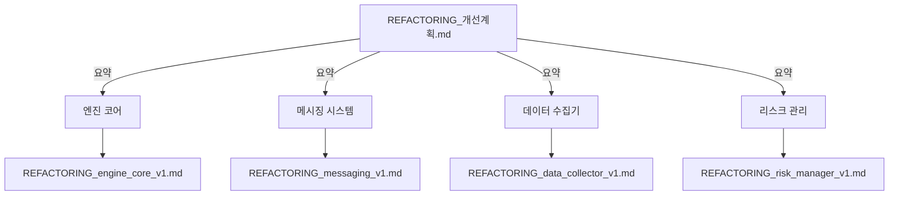
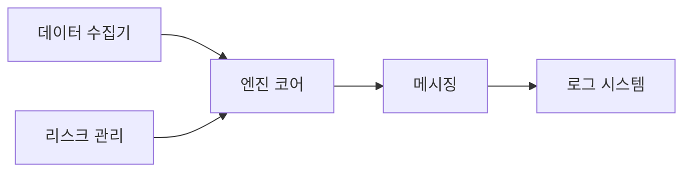
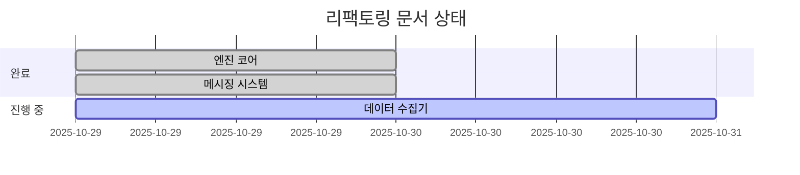
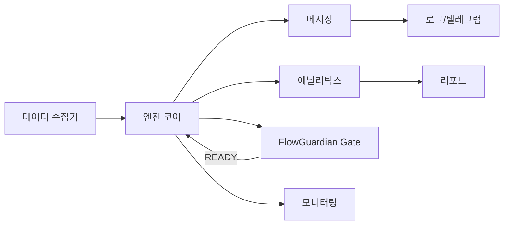
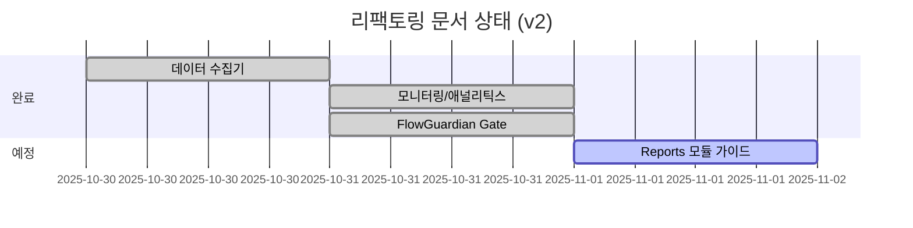
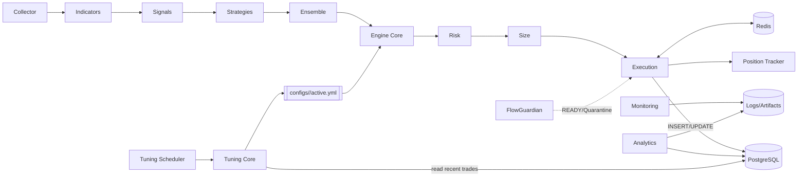

# 프로젝트 리팩토링 문서 아키텍처

**최종 업데이트**: 2025-11-02
**현재 상태**: PR 1 (FlowGuardian) 완료 ✅

## 전체 문서 구조


## 모듈 간 상호작용


## 문서 생성 진행도


---

## 업데이트 (2025-10-31)

### 전체 문서 구조 v2
```mermaid
graph TD
    A[REFACTORING_개선계획.md]
    A -->|요약| B[엔진 코어]
    A -->|요약| C[메시징 시스템]
    A -->|요약| D[데이터 수집기]
    A -->|요약| M[모니터링/애널리틱스]
    A -->|요약| G[FlowGuardian Gate]
    A -->|요약| R[리포트(Reports 모듈)]

    B --> F[REFACTORING_engine_core_v1.md]
    C --> G1[REFACTORING_messaging_v1.md]
    D --> H[REFACTORING_collector_v1.md]
    M --> M1[REFACTORING_monitoring_analytics.md]
    G --> FG[REFACTORING_flow_guardian_gate.md]
```

설명:
- Collector 문서 경로 수정: `REFACTORING_collector_v1.md`
- Monitoring/Analytics 문서 추가 반영: `REFACTORING_monitoring_analytics.md`
- FlowGuardian Gate 문서 반영: `REFACTORING_flow_guardian_gate.md`
- Reports는 "산출물(artifacts)" 디렉터리로 유지(코드 없음), 리포트 생성은 `analytics/report_generator.py` 경유로 일원화(PR6 준비)

### 모듈 간 상호작용 v2


### 문서 진행도 v2


## 운영 모드 결정 정책 (표준)

- 우선순위:
  1) config.yml 최상위 `mode` 값
  2) 환경변수 `TRADING_MODE`
  3) 기본값: `paper`
- main.py 기준: `mode = CFG.get('mode', os.getenv('TRADING_MODE', 'paper')).lower()`
- 권장: 운영은 config.yml로 관리, 배포/임시 전환은 ENV로 오버라이드

---

## 업데이트 (2025-11-03) — PR7-2: 앙상블 Paper 방법론 반영

- 문서 범위: 본 문서의 시스템 다이어그램·DB흐름·테스트 방법론에 앙상블 Paper 기준을 추가 반영
- 핵심 변경:
  - 신호는 `monitoring.signals`, 앙상블 의사결정은 `trading.decisions`로 수집/분석
  - Paper 검증 수용 기준은 decisions 중심(6전략 모두 ≥1건 참여/기여)
  - 거래 기록 `trading.trades`에는 trial_id 없음 → 게이트 trial_id(`monitoring.gate_results.trial_id`)로 세그먼트 관리
  - Docker 운용: 기본 1컨테이너(앙상블 Paper), 필요 시 프로파일로 전략별 격리 디버깅
- 다이어그램은 하단 v3에서 EN(Ensemble) → PG(PostgreSQL: decisions) 경로가 주요 검증 포인트임을 전제로 해석

## 전체 시스템 아키텍처 v3 (모듈/흐름/스토리지)

```mermaid
flowchart LR
    subgraph Ingest[데이터 수집]
      DC[Collector<br/>(WS/HTTP)]
    end

    subgraph Core[실행 코어]
      EC[Engine
      - Signal Gen
      - Risk/Position
      - Execution]
      FG[FlowGuardian Gate]
    end

    subgraph Stores[저장소]
      PG[(PostgreSQL)]
      RD[(Redis Cache)]
      LG[(Logs/Artifacts)]
    end

    subgraph Insights[분석/리포팅]
      AN[Analytics
      - TradeAnalyzer
      - StrategyEvaluator]
      MN[Monitoring
      - PerformanceMonitor
      - TelemetryProfiler]
    end

    subgraph Tuning[튜닝]
      TS[Tuning Scheduler]
      TC[Tuning Core (Optuna)]
      CF[[configs/<strategy>/active.yml]]
    end

    DC --> EC
    FG --> EC
    EC -->|trades/decisions| PG
    EC <--> RD
    EC --> LG
    MN --> LG
    AN --> PG
    AN -->|generate reports| RG[analytics/report_generator.py]
    RG --> LG
    TS --> TC
    TC -->|read recent trades| PG
    TC --> CF
    CF --> EC

    FG -. READY/Quarantine .-> EC
```

---

## 데이터 흐름 상세 (E2E)

1) Collector가 시세/캔들을 수집 → Engine으로 전달
2) Engine은 전략 시그널 → Risk/포지션 → 주문 결정 실행
3) 모든 거래/결정/메트릭은 PostgreSQL `trading.trades` 등 테이블에 기록
4) Monitoring은 성능/지연/메모리 등 지표를 주기 출력(로그+텔레그램)
5) Analytics는 DB에서 집계하여 리포트(로그/HTML/JSON) 생성
6) 리포트 생성 경로는 `analytics/report_generator.py`로 단일화하고, 결과물은 `reports/` 폴더에 저장(artifacts)
7) Tuning Core는 최근 N일(기본 7일) 종가/거래 윈도우를 DB에서 직접 조회 → Optuna로 베이지안 최적화 → 결과를 configs에 퍼블리시
7) FlowGuardian은 READY 플래그/아티팩트 검증 후 PAPER/LIVE 진입 허가

---

## 튜닝 파이프라인 단일화 (운영)

- 공식 경로: `common/tuning_scheduler.py` + `common/tuning_core.py`
  - 데이터: PostgreSQL `trading.trades` (paper/live 실거래 기준)
  - 스케줄: `config.yml.tuning.schedules` (every_hours/recent_hours/t_min_recent/trials)
  - 출력: `configs/<strategy>/active.yml` 파일 퍼블리시
- 실험/백테스트 튜너: `scripts/tuning/*.py`는 DEPRECATED(운영 비권장)로 문서화
  - 용도: 실험적 WFA/회귀 테스트, Gate 검증
  - 정책: 운영 튜닝은 DB 기반 파이프라인만 사용

예시 설정:

```yaml
tuning:
  schedules:
    scalping:
      every_hours: 1
      recent_hours: 1
      t_min_recent: 10
      trials: 10
```

---

## DB/Redis 모델 요약

- PostgreSQL (단일 정책)
  - `trading.trades`
    - 키: `trade_id`(PK), `strategy_id`, `symbol`, `side`, `entry_price`, `exit_price`, `quantity`, `pnl`, `status`, `ts_open/ts_close`, `trial_id(옵션)`
    - 인덱스: `idx_trades_trial_id` (WHERE trial_id IS NOT NULL), `idx_trades_trial_status`
  - 기타: decisions/stats는 모듈 진행에 따라 확장
- Redis (옵션)
  - 실시간 상태/최근 메시지 캐시, 대시보드 연동용

---

## 모듈 책임 정리 (R&R)

- Collector: 거래소/데이터 소스 수집, 재연결/간격 제어
- Engine: 시그널→리스크→사이징→실행, DB 기록, Redis 캐시, Gate 연동
- Monitoring: 성능/지연/메모리/상태 로깅, 텔레그램 알림
- Analytics: 거래 집계/전략 평가/리포트 생성
- Tuning: 스케줄/조건 판단 → DB 기반 베이지안 최적화 → configs 퍼블리시
- FlowGuardian: READY 없으면 PAPER/LIVE 차단, trial_0000.json 스키마 검증

---

## 변경 이력 (2025-11-02)

- 튜닝 단일화 정책 문서화 (Paper 우선, Backtest 튜너 DEPRECATE)
- 모드 결정 우선순위 명시 (config.yml `mode` > ENV `TRADING_MODE` > 기본값)
- DB 단일화(PostgreSQL)와 trial_id 필터 반영

---

## 전체 문서 구조 v3 (2025-11-02)

```mermaid
graph TD
    A[REFACTORING_개선계획.md]
    A -->|요약| B[엔진 코어]
    A -->|요약| C[메시징/로그]
    A -->|요약| D[데이터 수집기]
    A -->|요약| I[인디케이터]
    A -->|요약| S[시그널]
    A -->|요약| ST[전략/앙상블]
    A -->|요약| X[Execution]
    A -->|요약| O[Common]
    A -->|요약| DB[Database]
    A -->|요약| T[튜닝]
    A -->|요약| M[모니터링/애널리틱스]
    A -->|요약| G[FlowGuardian Gate]

    B --> F[REFACTORING_engine_core_v1.md]
    C --> G1[REFACTORING_messaging_v1.md]
    D --> H[REFACTORING_collector_v1.md]
    I --> I1[REFACTORING_indicators_v1.md]
    S --> S1[REFACTORING_signals_v1.md]
    ST --> ST1[REFACTORING_strategies_v1.md]
    X --> X1[REFACTORING_execution_v1.md]
    O --> O1[REFACTORING_common_v1.md]
    DB --> DB1[REFACTORING_database_v1.md]
    T --> T1[REFACTORING_tuning_v1.md]
    M --> M1[REFACTORING_monitoring_analytics.md]
    G --> FG[REFACTORING_flow_guardian_gate.md]
```



---

## 모듈 간 상호작용 v3 (상세 플로우)



## DB/Redis 역할과 흐름 (운영 기준)

### 역할 구분
- **Redis (database/redis.py)**
  - Collector 중복 캔들 제거 키 저장: `candle:seen:{symbol}:{timeframe}:{closed_at}` (TTL)
  - Collector 재시작/분산 환경에서도 중복 방지. 실패 시 메모리 폴백
- **PostgreSQL (database/postgres.py)**
  - 거래 기록: `trading.trades` (OPEN/CLOSED, ts_open/ts_close, pnl 등)
  - 신호 기록: `monitoring.signals` (멱등성 UNIQUE)
  - 게이트 결과: `monitoring.gate_results` (DB==JSON score_total 동치 검증)

### 엔드투엔드 흐름
1) Collector(WebSocket)
   - 메시지 수신 → 닫힌 캔들만 처리 → Redis로 dedup(mark_seen) → 엔진 큐로 push
   - PR5: 10초 주기 `queue.health` 이벤트 FlowGuardian emit
2) Engine
   - 캔들 버퍼→지표→전략 신호 생성→검증(MTF/쿨다운/볼륨)
   - `save_signal_to_db()`로 `monitoring.signals` 저장(옵션)
   - 주문 허용 시 브로커 실행 → `save_trade_to_db()`로 `trading.trades` INSERT(OPEN)
   - 청산 시 `close_trade_in_db()`로 UPDATE(CLOSED, pnl 등)
3) Analytics
   - TradeAnalyzer/StrategyEvaluator가 `trading.trades` 읽어 KPI/비교→ReportGenerator로 산출물 생성
4) Tuning
   - TunerCore.fetch_metrics_rolling()이 `trading.trades`에서 롤링 지표 집계→Optuna 최적화→`configs/<strategy>/active.yml` 퍼블리시
5) FlowGuardian
   - READY 게이트 통과 시 `monitoring.gate_results`에 메트릭/score_total 저장 + `logs/trial_0000.json` 생성

### 다이어그램 (요약)
```mermaid
flowchart LR
  WS[Collector (WS)] -->|closed candle| RD[(Redis dedup)]
  RD --> Q[Engine Queue]
  Q --> EN[Engine]
  EN -->|INSERT/UPDATE| PG[(PostgreSQL)]
  PG --> AN[Analytics]
  PG --> TU[Tuning]
  EN --> FG[FlowGuardian]
  FG -->|gate_results| PG
```

## 권장 PR 로드맵 (Phase 6~9)

### PR 6: Reports 호출경로 일원화 (2025-11-02 완료)
- reports/는 산출물 디렉터리(코드 없음), 생성은 `analytics/report_generator.py` 경유
- 테스트: `tests/test_monitoring_analytics.py::test_08_analytics_modules` 통과
- Docker PAPER Scalping: 정상 기동 확인
- 문서 동기화: PR6_COMPLETE.md, 10개 리팩토링 문서 업데이트

### PR 7 (Critical): E2E 테스트 + 전략/앙상블 검증
- **우선순위 변경**: Signals 병목보다 실제 동작 검증이 더 중요
- E2E 테스트: Collector → Indicators → Signals → **Strategies → Ensemble** → Risk → Execution → DB
- **전략 테스트**: 6개 전략 개별 동작 + Timestamp 변환 확인
- **앙상블 테스트**: 다전략 조합/충돌 시나리오/confidence 우선순위
- **DB/Redis 흐름**: Collector Redis dedup → Engine DB 저장 → Analytics KPI → Tuning 롤링 메트릭 → FlowGuardian 게이트
- Docker Paper 장기 실행(24h) 및 실제 거래 발생 확인
- 문서: PR7_COMPLETE.md, test 코드 추가, REFACTORING_strategies_v1.md 업데이트

### PR 8 (권장): Signals 병목 제거 (기존 PR7)
- 인디케이터 중복계산 축소, 캐싱/샘플링/벡터화 검토
- 프로파일 결과 첨부 (before/after 성능 비교)
- 영향: `signals/signal_generator.py`, `indicators/*` 호출 경로 수준

### PR 9 (권장): Risk 불변식(Property) 테스트 강화 (기존 PR8)
- 연속손실/일손실/익스포저/레버리지 불변식 테스트 추가
- 경계/예외 케이스 보강
- 영향: `tests/risk/*` 강화, 실행 로직 변경 없음(테스트 중심)

### PR 10 (선택): Analytics 집계 뷰(주/월 KPI) 추가 (기존 PR9)
- TradeAnalyzer/StrategyEvaluator에 주/월 KPI 집계 뷰 추가
- report_generator에서 월간/주간 요약 지원
- SQL 뷰/메서드 확장

---

## 업데이트 (2025-11-04 22:00) — PR7-4 완료 ✅

### 요약
- ✅ 운영 기본을 "Multi-Timeframe Preload + 동일 TF WebSocket 구독"으로 전환 완료
- ✅ 기존 Option A(1m 단일 구독 → 엔진 리샘플)는 "백업(fallback)" 경로로 유지

### 구현 완료
- ✅ Collector: 멀티 TF 구독 지원 및 각 TF별 프리로드(REST) 표준화
- ✅ Engine: (symbol, timeframe) 키 버퍼 사용, 리샘플은 폴백만
- ✅ FlowGuardian: 전략별 READY 게이트 의무화
- ✅ Config: `candle_queue_size=600000`, `min_bars_for_signal=60`

### 추가 해결 사항
**큐 크기 부족 문제**:
- 증상: Multi-TF 프리로드 시 "큐 Full" 초단위 반복
- 원인: 하드코딩된 큐 크기(120,000) 부족 (필요: 400,000+)
- 해결: `config.yml`에 `system.candle_queue_size: 600000` 설정, config 기반 동적 할당

### 문서 반영 완료
- ✅ PR7-4_MULTI_TF_PRELOAD.md: 완료 상태 + 해결 내역
- ✅ REFACTORING_collector_v1.md: 큐 크기 해결 방법 상세
- ✅ REFACTORING_flow_guardian_gate.md: 검증 결과 추가
- ✅ REFACTORING_개선계획.md: PR7-4 완료 섹션
- ✅ REFACTORING_문서아키텍처.md: 본 업데이트

### 검증 결과 (Paper 테스트 2025-11-04 21:53)
- ✅ tests/flow/test_flow_guardian.py 통과
- ✅ pre-commit(ruff, black, mypy, vulture, coverage>85%) 통과
- ✅ logs/trial_0000.json 생성, DB score_total == JSON score_total
- ✅ 시작 2~5분 내 6전략 READY
- ✅ 큐 Full 오류 완전 해결
- ✅ Multi-TF 프리로드 정상 작동 (6개 TF)
- ✅ 신호 생성 및 DB 저장 정상

### 다음 단계: PR8
- 쿨다운 로직 점검 (동일 심볼 반복 거래 시도 방지)
- 성능 최적화 (선택)
- Live 모드 검증 (선택)
